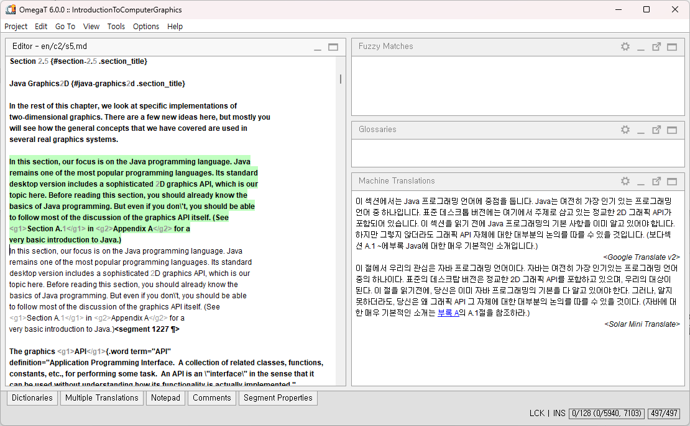

# OpenAI plug-in for Solar Mini

This plugin enables users to use machine translation provided by Solar in OmegaT CAT environment. It supports translation only between Korean and English (both Korean to English and English to Korean).



This plug-in is based on [OpenAI plug-in for OmegaT](https://github.com/ychoi-kr/omegat-plugin-openai-translate).
This software is open source software licensed under the GNU GPLv2. In addition, as a special exception, the copyright holders of this program give you permission to combine the program with free software programs or libraries that are released with code included in the standard release of [JSON-java Library](https://github.com/stleary/JSON-java) under the [JSON-java License](https://github.com/stleary/JSON-java/blob/master/LICENSE). You may copy and distribute such a system following the terms of the GNU GPL for this program and the licenses of the other code concerned. For detailed information, please refer to the LICENSE file.

## How to use

0. Get your API key from [Upstage](https://console.upstage.ai/).

1. Copy the plug-in file into directory:

    - Windows: Copy the plug-in file into %SystemDrive%%ProgramFiles%\OmegaT\plugins directory.
    - macOS: Copy the plug-in file into /Applications/OmegaT.app/Contents/Java/plugins directory.
    - GNU/Linux: Copy the plug-in file under the directory that OmegaT installed.

2. Set your Solar API key.

    - Windows: Open the file %SystemDrive%\%ProgramFiles%\OmegaT\OmegaT.I4J.ini and add this line:
    ```
    -Dsolar.api.key=YOURAPIKEY
    ```

    - macOS: Open the file /Applications/OmegaT.app/Contents/Resources/Configuration.properties with text editor and add this line:
    ```
    solar.api.key=YOURAPIKEY
    ```
   
    - In case of running the program with command line prompt, add this parameter:
    ```
    -Dsolar.api.key=YOURAPIKEY
    ```
   
3. Open OmegaT Application. From Options > Machine Translation, select Solar Translate.